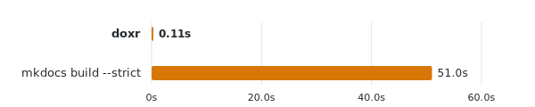

# drefs

[](https://github.com/scriptogre/drefs/actions/workflows/ci.yml)
[](https://pypi.org/project/drefs/)
[](https://pypi.org/project/drefs/)
[](LICENSE)

An extremely fast Python docstring cross-reference checker, written in Rust.

```bash
uvx drefs .
```

```
src/models.py:12:5: DREF001 Unresolved docstring reference `pkg.mdoels.User`. Did you mean `pkg.models.User`?
src/views.py:30:5: DREF001 Unresolved docstring reference `Nonexistent`. No import or definition found in this file
Found 2 errors.
```

<p align="center">
  <picture align="center">
    <source media="(prefers-color-scheme: dark)" srcset="assets/benchmark-dark-v3.svg">
    <source media="(prefers-color-scheme: light)" srcset="assets/benchmark-light-v3.svg">
    
  </picture>
</p>

<p align="center">
  <i>Validating cross-references in <a href="https://github.com/tinygrad/tinygrad">tinygrad</a> (697 Python files). <a href="BENCHMARKS.md">~460x faster</a> than <code>mkdocs build --strict</code>.</i>
</p>

## Supported syntax

drefs auto-detects the syntax you use:

- **MkDocs:** `[text][pkg.mod.Class]`, `[pkg.mod.Class][]`
- **Sphinx:** `` :class:`pkg.mod.Class` ``, `` :func:`pkg.mod.func` ``
- **Rust-style:** `[Symbol]`, `` [`Symbol`] ``, `[pkg.mod.Class]`

`[User]` resolves via the current file's imports. `[pkg.models.User]` resolves directly. Escape with `\[not a ref\]`.

drefs understands `__init__.py` re-exports, inheritance chains, and `self.x` attributes.

## Configuration

Optional. Add to `pyproject.toml`:

```toml
[tool.drefs]
src = ["src"]                  # auto-detected if omitted
style = "auto"                 # "mkdocs" | "sphinx" | "auto"
inventories = [                # validate against external symbols
    "https://docs.python.org/3/objects.inv",
]
```

## Editor support

### PyCharm / IntelliJ

- Ctrl+Click on each segment of a dotted path
- Syntax highlighting on cross-references
- Red squiggles on broken references

Install from `editors/jetbrains/build/distributions/drefs-pycharm-*.zip` via Settings > Plugins > Install from Disk.

## Contributing

See [CONTRIBUTING.md](CONTRIBUTING.md).

## License

MIT
